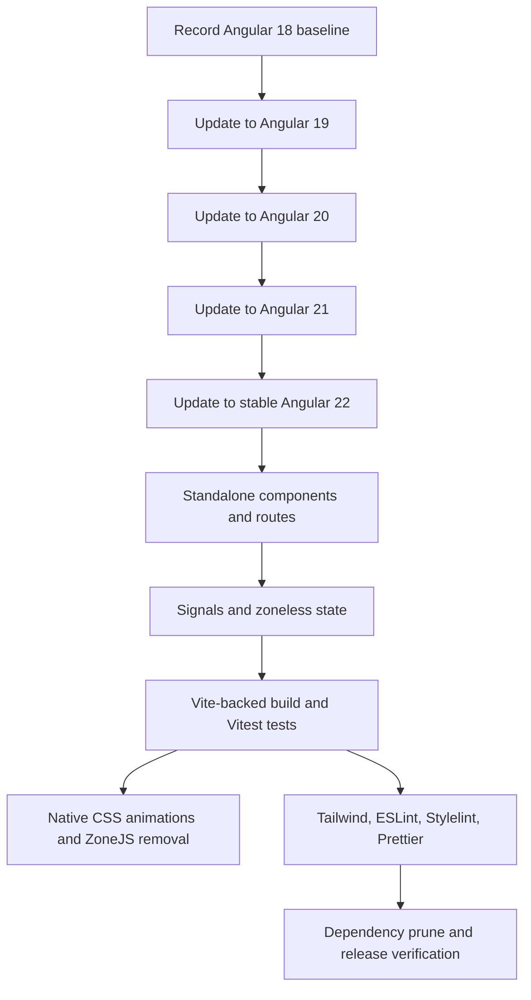
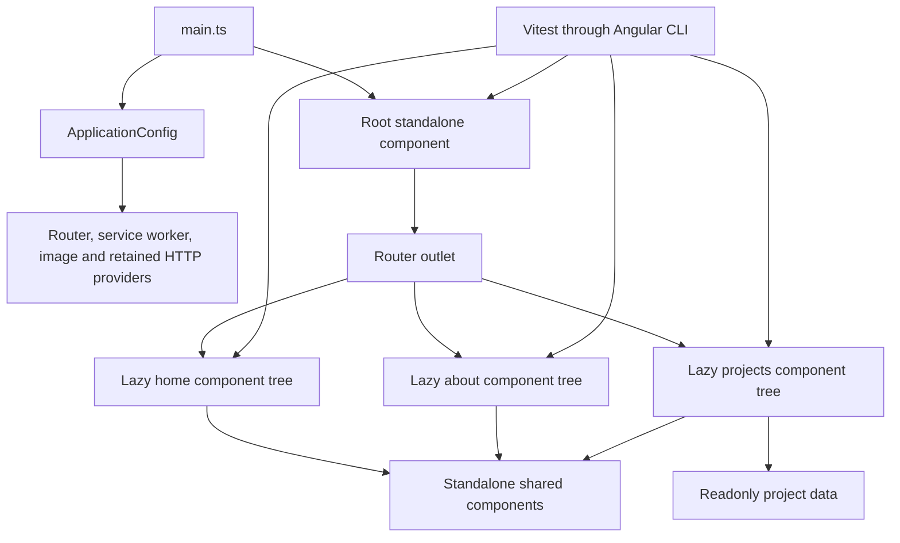

# Angular 22 Standalone Migration - Plan

## Goal Capsule

- **Objective:** Keep the portfolio maintainable, supported, and deployable without changing its visible content, navigation, PWA behavior, or responsive presentation.
- **Means:** Upgrade through each Angular major to the newest stable Angular 22 release, then adopt standalone APIs, Angular CLI's Vite-backed builders, zoneless-safe signals, Vitest, and current lint/format tooling (KTD1-KTD6).
- **Authority:** The requirements in this plan govern behavior; Angular's official migration schematics and version compatibility tables govern framework transitions; repository behavior and tests govern preservation details.
- **Execution profile:** Deep, dependency-ordered refactor with a build and test checkpoint after every Angular major and every structural migration.
- **Stop conditions:** Stop before advancing to the next major if the current migration leaves unexplained compiler, test, lint, PWA, or route failures. Do not paper over peer-dependency conflicts with forced installs.
- **Completion owner:** The implementer completes the code, lockfile, documentation, and verification work in this repository.

---

## Product Contract

### Summary

Migrate the Angular 18 portfolio to the newest stable Angular 22 release while preserving the existing site. Remove its NgModule architecture and legacy tooling, use signals only where state is genuinely reactive, and leave one coherent Vite-based build, test, lint, and formatting workflow.

### Problem Frame

The application is four Angular majors behind and combines modern pieces with legacy architecture. It already uses the `application` builder, but still bootstraps through `AppModule`, registers feature modules both eagerly and through lazy routes, runs Karma/Jasmine, loads ZoneJS, uses deprecated Angular animations, and carries packages and scripts that have no matching source usage.

Angular 22 requires a supported Node release and TypeScript 6.0, defaults to zoneless change detection, recommends standalone components, uses Vite inside the CLI development server, and defaults new projects to Vitest. Updating package numbers without migrating these seams would leave the repository technically upgraded but structurally obsolete.

### Requirements

**Framework and runtime**

- R1. All Angular framework, CLI, build, compiler, language-service, CDK-adjacent, and service-worker packages must resolve to the newest stable Angular 22-compatible versions without prerelease tags.
- R2. The migration must run official Angular update migrations one major at a time from 18 to 19, 19 to 20, 20 to 21, and 21 to 22, preserving a passing checkpoint between majors.
- R3. Node, npm, TypeScript, RxJS, and `tslib` constraints must match Angular 22's compatibility matrix; TypeScript must remain on the supported 6.0 line rather than the incompatible latest major.
- R4. The production build, development server, environment replacement, asset handling, service worker, and Vercel deep-link rewrite must continue to work after the upgrade.

**Application architecture**

- R5. All 19 application components must be standalone, all nine NgModule files must be removed, and application bootstrap must use standalone providers.
- R6. `/home`, `/about`, `/projects`, the empty-path redirect, wildcard redirect, page titles, and feature-level lazy loading must retain their current user-visible behavior.
- R7. Signal inputs and signals must replace decorator inputs and mutable template state where they improve zoneless rendering; immutable constants and imperative DOM-only calculations must not be wrapped in signals solely for consistency.
- R8. ZoneJS and the deprecated `@angular/animations` runtime must be removed, with timer-driven and toggle-driven views remaining reactive and their motion preserved through native CSS.

**Tooling and dependency hygiene**

- R9. Angular CLI's supported `application` and `dev-server` builders must remain the build boundary, using Vite through the CLI rather than adding a raw `vite.config` integration.
- R10. The test target and every retained specification must migrate from Karma/Jasmine to the Angular CLI Vitest runner, retaining equivalent assertions and adding coverage for migration-sensitive routing, signals, and timers. Tests for dead runtime paths may be deleted with those paths before runner migration.
- R11. Angular ESLint must move to its Angular 22-compatible flat configuration, and ESLint, Stylelint, and Prettier fixes must leave all covered source and configuration files clean.
- R12. Tailwind CSS and daisyUI must move to their current compatible major versions without changing the custom theme or rendered layout.
- R13. Runtime packages, development packages, scripts, configuration files, generated setup, and documentation with no remaining use must be removed; packages required by the PWA, styles, tests, or documented contributor workflow must remain.

### Success Criteria

- A clean install on a supported Node version completes without peer-dependency overrides.
- Production and development builds complete through Angular's Vite-backed builders, and the production output can be served with working deep links and a registered service worker.
- The full Vitest suite, Angular template/TypeScript lint, SCSS lint, and Prettier check pass after their respective fix commands have been applied.
- Repository searches find no `@NgModule`, `bootstrapModule`, `RouterModule.forRoot`, `RouterModule.forChild`, Karma configuration, Jasmine-only matcher, legacy ESLint configuration, or ZoneJS application import.
- `/home`, `/about`, and `/projects` render the same primary content and navigation behavior at desktop and narrow viewport widths.

### Scope Boundaries

The migration may reshape bootstrap, routing, reactive state, tests, styles tooling, and developer scripts. Portfolio copy, images, information architecture, visual redesign, SSR, prerendering, backend features, and new analytics are outside this work.

#### Deferred to Follow-Up Work

- Broader state-management abstractions beyond the current small component and static project-data needs.
- End-to-end browser-test infrastructure beyond the migration smoke checks and existing unit/component suite.
- Content corrections in portfolio copy or archived documentation that do not affect the migrated toolchain.

### Sources and Research

- Existing architecture and tests: `angular.json`, `package.json`, `src/main.ts`, `src/app/app.module.ts`, `src/app/app-routing.module.ts`, the nine `*.module.ts` files, and the nine `*.spec.ts` files.
- [Angular version compatibility](https://angular.dev/reference/versions) defines Angular 22's supported Node, TypeScript, and RxJS ranges.
- [Angular versioning and releases](https://angular.dev/reference/releases) requires multi-major upgrades to proceed one major at a time; Angular CLI `22.1.8` is the newest stable release observed during planning, while `22.2.0` remains prerelease.
- [Angular application build system](https://angular.dev/tools/cli/build-system-migration) establishes that the `application` builder is the supported esbuild/Vite path and that Vite is encapsulated by the CLI development server.
- [Standalone migration](https://angular.dev/reference/migrations/standalone) defines the convert declarations, remove modules, and standalone bootstrap sequence.
- [Zoneless Angular](https://angular.dev/guide/zoneless) documents zoneless-by-default behavior in Angular 21+ and removal of ZoneJS.
- [Karma-to-Vitest migration](https://angular.dev/guide/testing/migrating-to-vitest) defines the CLI unit-test builder, dependency cleanup, and Jasmine refactoring schematic, while noting that existing-project migration remains experimental.
- [Angular animations migration](https://angular.dev/guide/animations/migration) deprecates `@angular/animations` and recommends native CSS.
- [angular-eslint configuration](https://github.com/angular-eslint/angular-eslint/blob/main/docs/CONFIGURING_ESLINT.md) requires flat config and ESLint 9 or 10 for angular-eslint 22.
- [Angular Tailwind guide](https://angular.dev/guide/tailwind) and [daisyUI 5 upgrade guide](https://daisyui.com/docs/upgrade/) define the Tailwind 4 PostCSS and CSS-first plugin configuration.

---

## Planning Contract

### Key Technical Decisions

- KTD1. **Use Angular CLI's native Vite path.** Keep the supported `application` and `dev-server` boundary and migrate it to `@angular/build`; do not add raw Vite configuration that would bypass Angular compilation, service-worker integration, or CLI migrations. (session-settled: user-approved — chosen over direct Vite configuration: the supported CLI path preserves Angular-specific build behavior while still using Vite)
- KTD2. **Upgrade one major at a time.** Run and review official migrations at every major boundary, with dependency alignment and a verification checkpoint before continuing. This is required by Angular's supported update policy and isolates migration failures.
- KTD3. **Replace module routes with lazy standalone route definitions.** Use a root route configuration and feature route files or lazy standalone components so each public path is registered exactly once; do not preserve the current eager-plus-lazy feature-module duplication.
- KTD4. **Adopt signals selectively.** Convert decorator inputs and mutable template state, including navigation, filtering, description selection, and testimonial rotation. Keep immutable portfolio data as readonly values and leave pointer calculations imperative because neither benefits from reactive storage. (session-settled: user-approved — chosen over a broad service/state rewrite: focused conversion reduces risk while making zoneless rendering reliable)
- KTD5. **Move fully to zoneless and native CSS.** Remove ZoneJS after state notifications and tests are zoneless-safe, and translate the two Angular animation triggers to CSS class transitions. This avoids dependencies that Angular 22 defaults away from and plans to remove.
- KTD6. **Use the CLI Vitest runner despite the migration's experimental label.** The suite is small, uses no custom browser launcher behavior that must be preserved, and migrating now removes Karma, Jasmine, Puppeteer-era support, and browser-dynamic test bootstrap in one bounded change. A failed runner migration blocks removal of Karma until equivalent coverage passes.
- KTD7. **Upgrade styling as a paired system.** Move Tailwind 3 and daisyUI 4 together to Tailwind 4 and daisyUI 5, migrate the custom theme into CSS-first configuration, and preserve Material Icons separately because templates still use it.
- KTD8. **Generate modern lint configuration, then reapply local intent.** Start from angular-eslint 22's flat-config output, retain selector conventions and Angular template rules, remove obsolete formatter-conflict packages, and let Prettier own formatting concerns.

### High-Level Technical Design

The work advances only when the preceding checkpoint is understood. Framework migrations come before optional modernization so an Angular update failure is not mixed with hand-written structural changes. Standalone routing comes before signals because it determines component imports and test setup. ZoneJS is removed only after signal and timer behavior is covered.

This target topology implements KTD1, KTD3, KTD4, and KTD6. Bootstrap owns application-wide providers, route boundaries own lazy loading, components own their template dependencies and local signals, and tests consume the same standalone surfaces without a parallel module graph.

### System-Wide Impact

- **End users:** The site should look and navigate the same; regression risk is concentrated in lazy routes, animation state, timer-driven testimonials, Tailwind theme output, and offline caching.
- **Developers:** Node 18 is no longer sufficient. Install, test, lint, formatting, and pre-commit behavior change together and must be documented as one workflow.
- **Deployment:** The application builder's output layout and service-worker artifacts affect `serve:sw` and Vercel verification even though the public hosting contract does not change.
- **Repository maintenance:** Removing modules, Karma, legacy lint configuration, dead proxy/i18n scaffolding, and unused packages reduces the number of overlapping configuration systems.

### Risks and Mitigations

| Risk | Evidence | Mitigation |
| --- | --- | --- |
| A multi-major jump hides which migration introduced a regression | The repository starts on Angular 18.2.2 | Upgrade and verify one major at a time; review each migration diff before continuing. |
| Zoneless mode stops timer-driven or plain-field UI updates | The testimonial timer and menu/filter state currently mutate fields | Convert template-observed mutable state to signals and test updates without forced change detection. |
| Standalone routing changes URLs or loads a feature twice | Feature modules are both imported by `AppModule` and referenced by `loadChildren`; child routes repeat their parent path | Define each public route once and add route-recognition and navigation tests before deleting modules. |
| Vitest migration misses Jasmine-specific behavior | Existing specs use `waitForAsync`, `spyOn`, `jasmine.stringMatching`, `toBeFalse`, and `fail` | Run the official refactoring schematic, manually review every spec, and retain Karma until all equivalents pass. |
| Tailwind 4/daisyUI 5 changes theme output | The custom `mytheme` palette currently lives in `tailwind.config.js` | Migrate theme tokens deliberately and compare representative pages at desktop and narrow widths. |
| Dependency pruning removes an implicit tool | Several scripts reference missing or old tooling, while other packages have no source imports | Trace every candidate through source, scripts, configs, and docs; remove in coherent groups and verify clean install plus all scripted checks. |
| PWA assets or serving path drift under the new builder | `serve:sw` serves `dist`, while the application builder commonly emits a `browser` subdirectory | Verify the actual Angular 22 output tree, update the serving script and service-worker asset patterns, then test an installed production build. |

### Phased Delivery

1. Establish the supported runtime and complete official framework migrations.
2. Replace module architecture and duplicated route registration.
3. Make state zoneless-ready and migrate retained tests to Vitest-native async behavior.
4. Remove deprecated runtime facilities, then modernize style, lint, format, and contributor tooling.
5. Prune dead dependencies and validate the production/PWA/deployment contract.

Implementation-unit IDs remain stable references rather than sequence numbers. Execute them in this dependency order: **U1 → U2 → U3 → U5 → U4 → U6 → U8 → U7**.

---

## Implementation Units

### U1. Establish the baseline and migrate Angular 18 through 22

- **Goal:** Reach the newest stable Angular 22 release with every official migration applied and a compatible runtime/toolchain matrix.
- **Requirements:** R1-R4.
- **Dependencies:** None.
- **Files:** `package.json`, `package-lock.json`, `angular.json`, `tsconfig.json`, `tsconfig.app.json`, `tsconfig.spec.json`.
- **Approach:**
  1. Record the existing install, build, test, lint, and package-health outcomes so pre-existing failures are distinguished from migration regressions; the dead interceptor tests referencing an absent `environment.serverUrl` require explicit classification.
  2. Before changing the styling toolchain, capture `/home`, `/about`, and `/projects` at fixed desktop and mobile viewport sizes, including open navigation and filter states, as the visual-regression baseline.
  3. Update Angular core and CLI to the latest patch of 19, 20, 21, and then stable 22, allowing each release's schematics to change configuration and source.
  4. At each boundary, align first-party Angular packages, the angular-eslint package family, and the supported TypeScript range, review migration output, and complete the checkpoint before advancing. Defer the flat-config and rule cleanup to U8, but do not leave an Angular 18 angular-eslint peer range installed against Angular 19+.
  5. Finish with Angular 22-compatible Node/npm engines, TypeScript 6.0.x, RxJS, `tslib`, and `@types/node`; never use `--force` to conceal an incompatible peer range.
- **Execution note:** This is migration/configuration work; prefer clean-install, compiler, and runtime smoke evidence at each major boundary before hand-written refactors.
- **Patterns to follow:** Angular's official `ng update` workflow and version compatibility table.
- **Test scenarios:**
  - Install from the regenerated lockfile on the minimum documented Node line and on the active Node 24 line; both resolve one Angular 22 package family without peer overrides.
  - Build the development and production configurations after each major; any newly introduced diagnostic is resolved before the next update.
  - Run the current test and lint commands at each checkpoint and record whether a failure existed at baseline or was introduced by that major.
  - Confirm the fixed-viewport page and open-state captures are readable and stored as temporary migration evidence before changing Tailwind or daisyUI.
- **Verification:** The dependency graph contains stable Angular 22 packages only, engine constraints match Angular 22, and the repository reaches a reproducible Angular 22 build before architectural modernization begins.

### U2. Convert declarations, bootstrap, and routing to standalone APIs

- **Goal:** Replace all NgModules with standalone components, providers, and lazy route configuration while preserving public navigation.
- **Requirements:** R5, R6, R9.
- **Dependencies:** U1.
- **Files:** `src/main.ts`, `src/app/app.component.ts`, `src/app/app.config.ts` (new), `src/app/app.routes.ts` (new), `src/app/app-routing.module.ts` (delete), `src/app/app.module.ts` (delete), `src/app/shared/shared.module.ts` (delete), `src/app/home/home.module.ts` (delete), `src/app/home/home-routing.module.ts` (delete), `src/app/about/about.module.ts` (delete), `src/app/about/about-routing.module.ts` (delete), `src/app/work/projects.module.ts` (delete), `src/app/work/projects-routing.module.ts` (delete), all 19 `src/app/**/*.component.ts` files, `src/app/app.component.spec.ts`, `src/app/home/components/hero-section/hero-section.component.spec.ts`, `src/app/home/components/work-section/work-section.component.spec.ts`, `src/app/about/components/techstack-section/techstack-section.component.spec.ts`, `src/app/shared/components/portfolio-index/portfolio-index.component.spec.ts`, `src/app/shared/src/http/api-prefix.interceptor.ts` and its spec (delete if confirmed unused), `src/app/shared/src/http/error-handler.interceptor.ts` and its spec (delete if confirmed unused), `proxy.conf.js` (delete if confirmed unused), `src/app/app.routes.spec.ts` (new).
- **Approach:**
  1. Run the standalone schematic in its documented declaration, module-removal, and bootstrap phases, reviewing imports after each phase.
  2. Move root providers for router, service worker, HTTP only if still used, image configuration, and any animation transition support into `ApplicationConfig` provider functions.
  3. Replace module lazy loading with standalone route definitions that use empty feature child paths or direct lazy components, eliminating the current repeated `home`, `about`, and `projects` path segments.
  4. Replace broad `CommonModule` imports with the built-in control-flow syntax and precise standalone directives/pipes where needed.
  5. Update TestBed declarations to standalone imports and provider-based router testing; make test stub components standalone or replace them with real lightweight imports.
  6. While inventorying root providers, resolve the currently unregistered HTTP interceptors and proxy path: if repository-wide tracing confirms there is no application HTTP consumer, delete the dead runtime files, their failing specs, proxy configuration, and associated package before Vitest migration; otherwise register and modernize the path explicitly.
- **Patterns to follow:** `src/app/work/components/project-filter/project-filter.component.spec.ts` and `src/app/work/project-page/project-page.component.spec.ts` already import their subject as though it were standalone; normalize the remaining specs to that shape.
- **Test scenarios:**
  - Navigate to `/`, `/home`, `/about`, and `/projects`; each resolves to the intended component once, sets the expected title, and does not create duplicated route segments.
  - Navigate to an unknown path; the router redirects to `/home` without a loop.
  - Load `/about` and `/projects` directly from a fresh browser session; their lazy chunks render successfully.
  - Create each migrated standalone component in TestBed with only its declared imports/providers; template compilation reports no hidden module dependency.
  - Render the root component on an editorial route and a project route; the global navbar remains hidden and visible respectively.
- **Verification:** Repository search finds no module decorator, module bootstrap, or feature routing module; all public routes and component tests pass through standalone APIs.

### U3. Make template state signal-based and zoneless-safe

- **Goal:** Convert the state that drives rendered output to signals without turning immutable data or event-local calculations into reactive abstractions.
- **Requirements:** R7, R8.
- **Dependencies:** U2.
- **Files:** `src/app/app.component.ts`, `src/app/about/components/about-description-section/about-description-section.component.ts`, `src/app/about/components/testimonial-carousel/testimonial-carousel.component.ts`, `src/app/shared/components/nav-bar/nav-bar.component.ts`, `src/app/shared/components/portfolio-index/portfolio-index.component.ts`, `src/app/shared/components/wavy-header/wavy-header.component.ts`, `src/app/shared/src/hovable-icon/hovable-icon.component.ts`, `src/app/work/components/project-card/project-card.component.ts`, `src/app/work/components/project-filter/project-filter.component.ts`, `src/app/work/data/projects.service.ts`, their templates, `src/app/app.component.spec.ts`, `src/app/about/components/about-description-section/about-description-section.component.spec.ts` (new), `src/app/about/components/testimonial-carousel/testimonial-carousel.component.spec.ts` (new), `src/app/shared/components/nav-bar/nav-bar.component.spec.ts` (new), `src/app/work/components/project-filter/project-filter.component.spec.ts`.
- **Approach:**
  1. Use signal inputs for the existing `@Input` fields and update template reads, tests, and required/optional semantics explicitly.
  2. Use writable and computed signals for description selection, menu/filter toggles, testimonial index, hover/focus pause state, and route-derived navbar visibility.
  3. Replace the `ProjectsService` BehaviorSubject, which synchronously republishes static data on every call, with a readonly data surface; do not retain an observable or introduce a signal where immutable data is sufficient.
  4. Keep pointer parallax calculations and static arrays as ordinary methods/readonly values because they do not represent shared or template-observed reactive state.
  5. Ensure timers are cleaned up with Angular lifecycle cleanup and that timer callbacks update signals so Angular schedules zoneless rendering.
- **Patterns to follow:** Existing built-in `@for` blocks and `inject()` usage in `ProjectPageComponent`.
- **Test scenarios:**
  - Change each signal input through the fixture API; the component template reflects the new value and preserves defaults for omitted optional inputs.
  - Select every description option; the matching description is rendered, and an unknown value yields the existing fallback.
  - Toggle the navbar and project filter twice; open/closed state and accessibility-visible content return to their initial state.
  - Advance the testimonial fake timer; the active quote changes, pauses during hover or focus-within, resumes with the remaining duration, wraps at the final item, and stops after component destruction.
  - Complete a router navigation between editorial and non-editorial routes; navbar visibility updates without manually forcing change detection.
  - Render the project page; the static projects appear once without an async pipe or repeated data publication.
- **Verification:** Template-observed asynchronous/mutable state uses signal-based notification paths with migration-sensitive coverage in place, while static data and event-local calculations remain simple values; actual execution without ZoneJS is verified in U4.

### U4. Replace deprecated Angular animations and remove ZoneJS

- **Goal:** Preserve menu and filter motion with native CSS and complete the Angular 22 zoneless runtime transition.
- **Requirements:** R8, R13.
- **Dependencies:** U3, U5.
- **Files:** `src/polyfills.ts`, `angular.json`, `package.json`, `package-lock.json`, `src/app/shared/components/nav-bar/nav-bar.component.ts`, `src/app/shared/components/nav-bar/nav-bar.component.html`, `src/app/shared/components/nav-bar/nav-bar.component.scss`, `src/app/work/components/project-filter/project-filter.component.ts`, `src/app/work/components/project-filter/project-filter.component.html`, `src/app/work/components/project-filter/project-filter.component.scss`, `src/app/shared/components/nav-bar/nav-bar.component.spec.ts`, `src/app/work/components/project-filter/project-filter.component.spec.ts`.
- **Approach:**
  1. Translate the `slideDown` and `slideInOut` state triggers into CSS classes and transitions driven by the signals from U3, retaining timing, opacity, height, stacking, and reduced-motion behavior.
  2. Remove browser animation providers and `@angular/animations` imports once no trigger remains.
  3. After U5 has removed Zone-dependent test helpers, remove `zone.js` from polyfills, test configuration, and dependencies; reduce `src/polyfills.ts` to only a demonstrably required polyfill or delete it and configure remaining polyfills directly.
  4. Validate that Angular 22's default zoneless scheduling is not overridden by a compatibility provider.
- **Patterns to follow:** Existing component-scoped SCSS and the repository's `prefers-reduced-motion` styling conventions where present.
- **Test scenarios:**
  - Toggle the navigation overlay; the open and closed classes expose the same final height, opacity, and stacking states as before.
  - Toggle the project filter; its content becomes visible and hidden without an Angular animation trigger.
  - Enable reduced-motion preference in a browser smoke check; both transitions complete without disorienting motion.
  - Run component tests with no ZoneJS patch; signal and timer tests settle through native async/fake-timer mechanisms.
- **Verification:** `@angular/animations`, `zone.js`, animation providers, and legacy trigger syntax are absent; the two interactive transitions and zoneless tests remain functional.

### U5. Move the test suite from Karma/Jasmine to Angular CLI Vitest

- **Goal:** Run the complete suite through `@angular/build:unit-test` with Vitest and DOM emulation, then remove all Karma/Jasmine bootstrap and packages.
- **Requirements:** R10, R11, R13.
- **Dependencies:** U2, U3.
- **Files:** `angular.json`, `package.json`, `package-lock.json`, `tsconfig.spec.json`, `karma.conf.js` (delete), `src/test.ts` (delete), every retained `src/app/**/*.spec.ts` file after U2's dead-path decision, and new specs from U3.
- **Approach:**
  1. Configure the Angular CLI unit-test builder with Vitest and `jsdom`, using the development build configuration rather than duplicating build options in the test target. Keep ZoneJS only as a temporary compatibility layer while the retained specs are converted.
  2. Run the official Jasmine-to-Vitest refactoring schematic, then manually review all specs for matchers, spies, failure helpers, async wrappers, router setup, and fake timers it cannot safely convert.
  3. Prefer native async and Vitest timers instead of retaining the ZoneJS Vitest patch.
  4. Preserve coverage capability through the CLI and carry over only reporter behavior that is actually consumed by CI or repository scripts.
  5. Delete Karma configuration, `src/test.ts`, Jasmine types/reporters, Karma packages, and browser-launcher dependencies only after the migrated suite passes; confirm no retained spec uses `waitForAsync`, `fakeAsync`, `tick`, or `zone.js/testing` before handing off to U4.
- **Patterns to follow:** Angular's CLI-managed Vitest configuration; avoid a custom `vitest.config` unless an existing `karma.conf.js` behavior proves necessary.
- **Test scenarios:**
  - Run all migrated specs in non-watch mode; the same component rendering, router, HTTP, and interaction assertions pass under Vitest.
  - Run the testimonial timer cases with fake timers; no real eight-second wait or ZoneJS helper is required.
  - Run coverage; all spec files are discovered once and a coverage report is produced.
  - Run in a CI-like environment; the test command exits deterministically without opening Chrome or remaining in watch mode.
- **Verification:** `ng test` uses Vitest, every retained spec passes, coverage works, and no Karma/Jasmine runtime, config, type, or matcher remains.

### U6. Modernize Tailwind and daisyUI

- **Goal:** Bring the CSS utility and component-theme stack onto current compatible majors without changing the portfolio's visual presentation.
- **Requirements:** R12.
- **Dependencies:** U1, U2.
- **Files:** `package.json`, `package-lock.json`, `tailwind.config.js` (delete after migration), `.postcssrc.json` (new), `src/main.scss`, `src/styles/tailwind.scss` (consolidate or delete), `src/styles/theme-variables.scss`, and templates whose daisyUI 5 class behavior changed.
- **Approach:**
  1. Migrate Tailwind to its Angular-supported PostCSS integration and daisyUI to CSS-first plugin configuration; preserve the `mytheme` colors and eliminate duplicate Tailwind imports.
  2. Use Tailwind 4 and daisyUI 5's CSS-first configuration as the only source for framework imports, content discovery, plugin activation, and custom theme values.
  3. Review the daisyUI 4 classes present in templates against the v5 breaking-change list and adjust only classes whose semantics changed.
- **Patterns to follow:** Preserve the `mytheme` color intent from `tailwind.config.js` and the global import order in `src/main.scss`.
- **Test scenarios:**
  - Build all pages after the Tailwind/daisyUI migration; utilities used for layout, gaps, colors, responsive variants, and the `mytheme` palette are present in generated CSS.
  - Compare `/home`, `/about`, and `/projects` at the same fixed desktop/mobile sizes and open interaction states captured in U1; no spacing, typography, theme color, filter, or navigation regression is visible.
  - Inspect the generated stylesheet; Tailwind layers and daisyUI theme variables occur once rather than through both `src/main.scss` and `src/styles/tailwind.scss`.
- **Verification:** Tailwind 4/daisyUI 5 render the existing design, the custom theme survives, and obsolete JavaScript Tailwind configuration is gone.

### U8. Modernize ESLint, Stylelint, Prettier, and fix passes

- **Goal:** Replace legacy quality-tool configuration with current Angular 22-compatible tooling and leave every covered file clean after automatic fixes.
- **Requirements:** R11, R13.
- **Dependencies:** U2, U3, U5, U4, U6.
- **Files:** `package.json`, `package-lock.json`, `.eslintrc.json` (delete), `eslint.config.js` (new), `.stylelintrc` (replace or migrate to `stylelint.config.mjs`), `.prettierignore` (new if needed), `.prettierrc.json` (new or keep equivalent package metadata), all covered `src/**/*.{ts,html,scss}` files, and supported root configuration files touched by automatic fixes.
- **Approach:**
  1. Generate angular-eslint 22 flat configuration from the package family already aligned in U1 and retain the `app` selector rules, recommended TypeScript rules, inline-template processing, and recommended template rules.
  2. Remove legacy granular angular-eslint/typescript-eslint packages when the current aggregate packages own them, and remove unused ESLint plugins that no configured rule references.
  3. Upgrade Stylelint with its standard SCSS configuration, remove the obsolete Prettier compatibility preset and deleted stylistic rules, and retain project-specific safety limits where current rule names support them.
  4. Upgrade and pin Prettier 3, expand format coverage to relevant source and root configuration files, apply Prettier once, apply ESLint and Stylelint fixes, then run non-mutating checks.
- **Patterns to follow:** Preserve the repository's single-quote TypeScript preference and double-quote SCSS preference unless current formatter/parser behavior requires one documented adjustment.
- **Test scenarios:**
  - Run ESLint autofix followed by lint check; TypeScript and templates report no remaining errors and a second fix run produces no diff.
  - Run Stylelint autofix followed by lint check; all SCSS files parse with the modern SCSS config and a second fix run produces no diff.
  - Run Prettier write followed by check; all configured files pass and a second write produces no diff.
  - Stage representative TypeScript, HTML, SCSS, and root configuration files; the formatting hook touches only supported staged files and leaves unstaged files unchanged.
- **Verification:** Flat ESLint and modern Stylelint are the only lint configurations, Prettier owns formatting, and every fix/check pair is idempotent.

### U7. Prune dead dependencies and finish the contributor, PWA, and deployment workflow

- **Goal:** Remove obsolete scaffolding and prove that the resulting package and scripts describe only supported, working workflows.
- **Requirements:** R4, R13.
- **Dependencies:** U1, U2, U3, U5, U4, U6, U8.
- **Files:** `package.json`, `package-lock.json`, `generate-env.js`, any HTTP/proxy documentation left stale by U2's provider decision, `src/polyfills.ts`, `src/translations/en-US.json`, `tslint.json` (delete), `.husky/pre-commit`, `README.md`, `docs/readme.md`, `docs/updating.md`, `docs/i18n.md`, `docs/backend-proxy.md`, `docs/corporate-proxy.md`, `docs/coding-guides/typescript.md`, `docs/coding-guides/sass.md`, `ngsw-config.json`, `vercel.json`.
- **Approach:**
  1. Trace every dependency through imports, scripts, configuration, and current documentation before removal. Known candidates include unused CDK, Forms, Lodash and types, `@ngneat/until-destroy`, localize/translation scaffolding, browser-dynamic after bootstrap/test migration, old test packages, unused ESLint plugins, Compodoc/Puppeteer support, and `ts-node`.
  2. Verify that U2's HTTP-provider decision is reflected consistently in packages and documentation: remove any remaining corporate proxy agent or related docs when the path was deleted, or document the explicitly retained and registered request path.
  3. Remove broken or stale scripts such as translation extraction and docs serving when their executables are not installed and no maintained workflow consumes their output.
  4. Replace the install-time formatting side effect with a current Husky setup and a focused staged-file formatter; installation must not rewrite the working tree.
  5. Correct production serving paths for the Angular 22 application-builder output, verify service-worker file patterns and manifest assets, and update contributor documentation with supported Node, install, serve, test, lint, format, and production-preview commands.
- **Execution note:** Treat pruning as evidence-driven cleanup. Remove a package only in the same change that removes or replaces its last consumer, then rerun the relevant smoke check.
- **Patterns to follow:** Existing `vercel.json` SPA rewrite and `ngsw-config.json` asset-group intent.
- **Test scenarios:**
  - Install from a clean checkout; the install completes without changing tracked files and the pre-commit hook can format a staged supported file.
  - Run every retained package script; each command resolves a local executable and either completes or enters its documented watch/serve mode.
  - Serve the production output from its actual browser output directory; direct requests for `/about` and `/projects` return the application shell.
  - Load the production build, register the service worker, reload offline, and confirm the shell plus representative image/font assets remain available.
  - Deploy or run the Vercel-equivalent preview; deep links resolve through the rewrite and hashed assets are served from their generated paths.
  - Audit installed direct dependencies; each has a source, build, test, style, documentation, or hook consumer and no removed package remains in the lockfile.
- **Verification:** Clean install, every retained script, production preview, PWA offline smoke, and dependency audit pass with documentation matching the resulting workflow.

---

## Verification Contract

| Gate | Command or check | Applies after | Done signal |
| --- | --- | --- | --- |
| Reproducible install | `npm ci` | U1 and final | Lockfile installs without peer overrides or tracked-file changes. |
| Development build | `npm run build -- --configuration development` | Every unit in execution order | Angular compilation and asset processing complete. |
| Production build | `npm run build` | Every unit in execution order | Optimized browser output, service-worker files, and budgets complete. |
| Unit/component tests | `npm test -- --watch=false` | U2, U3, U5, U4, U6, U8, U7 | All Vitest files pass once in CI-compatible mode. |
| Coverage | `npm test -- --watch=false --coverage` | U5, U4, U6, U8, U7 | Coverage report completes with all retained specs discovered. |
| Angular/TypeScript/template lint | `npm run lint` | U2, U3, U5, U4, U6, U8, U7 | ESLint reports no errors after fixes. |
| Style lint | Retained dedicated Stylelint script | U4, U6, U8, U7 | SCSS lint reports no errors after fixes. |
| Formatting | `npm run prettier:check` or renamed equivalent | U2, U3, U5, U4, U6, U8, U7 | Prettier reports no differences after the write pass. |
| Structural audit | Search for removed APIs and configs | U2, U3, U5, U4, U6, U8, U7 | No NgModules, module bootstrap/routes, ZoneJS, Karma/Jasmine, legacy ESLint, or deleted package references remain. |
| Browser smoke | `/home`, `/about`, `/projects`, unknown route, mobile/desktop | U2, U3, U5, U4, U6, U8, U7 | Routes, titles, navbar rules, interactions, animations, and layout match requirements. |
| PWA/deployment smoke | Serve the production output and exercise offline/deep links | U7 | Service worker registers, cached shell/assets work offline, and Vercel-style rewrites resolve. |

The final verification must run from a clean install rather than a warmed `node_modules`. Any migration warning, skipped schematic TODO, or ignored lint failure keeps the plan incomplete until explained and resolved.

---

## Definition of Done

- R1-R13 are satisfied with stable Angular 22 packages and no prerelease dependency.
- All eight implementation units meet their verification outcomes in the stated execution order, and all feature-bearing tests pass under Vitest.
- All 19 components are standalone and all nine NgModule files are gone.
- Angular CLI owns the Vite-backed build/dev flow; no direct Vite configuration or parallel builder remains.
- ZoneJS, deprecated Angular animations, Karma/Jasmine, obsolete lint configuration, and every confirmed-unused direct dependency are removed from source, configuration, documentation, and lockfile.
- Signals cover template-observed mutable state and inputs without expanding into an unnecessary application-wide state architecture.
- Prettier, ESLint, and Stylelint fix passes are applied; their subsequent check passes are clean and idempotent.
- Production build, PWA/offline behavior, Vercel deep links, and representative responsive pages have been smoke-tested.
- Documentation names the supported runtime and only commands that work in the final repository.
- No abandoned migration experiments, generated TODOs, commented-out compatibility code, or superseded configuration files remain in the final diff.
